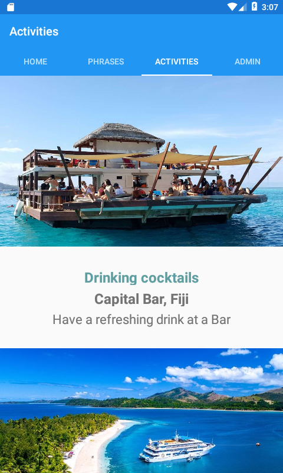

# FijiDiscover

This was a project I done while studying. It is a mobile app built with Xamarin
The requirements were just for an android version

Specific Project Requirements - 
Mobile app should:
- be implemented in Xamarin.Android or Xamarin.Forms.
- connect to a database containing information about the activities, sites to visit and common phrases.
   You are expected to create the Activities.db3 database and populate it with test data.
- contain the following pages:
  - Home screen – include the app logo and cover photo. 
  - Phrase book page – list common phrases travellers might use in their travels.
  - Activities page – display information about sights and activities retrieved from the Activities.db3 database. 
    Each activity should have, at a minimum, a description, photo and location.
  - Administration page – allow the administrator to add new activities to the Activities.db3 database. 
    Each activity should have, at a minimum, a description, photo and location.
    
- use consistent styling for all pages. You should select page layouts that are the most appropriate for the information.
- have its navigation set up. 

 

